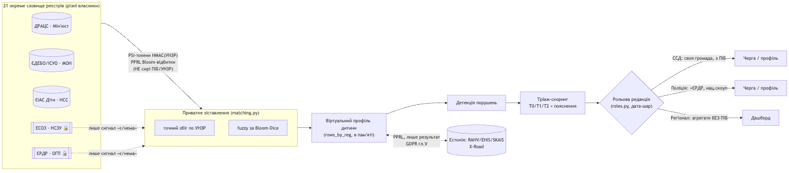
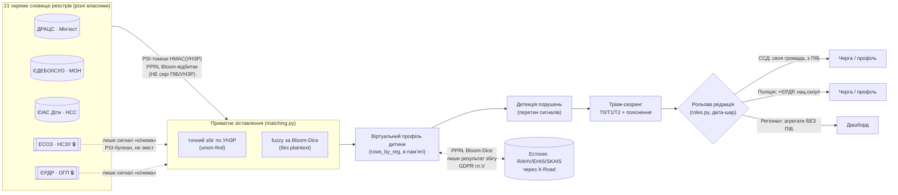
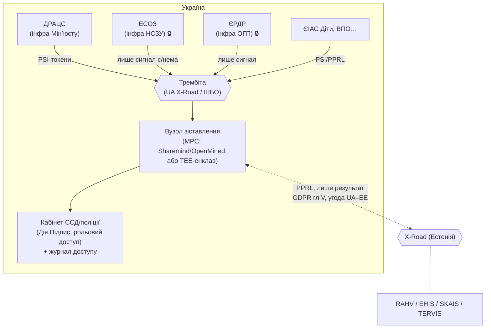

# Ластівка — Безпека та архітектура (як працює зараз / як на реальних даних)

> Для презентації журі + для власного розуміння. Кожна теза прив'язана до коду.

## 0. TL;DR
Ластівка **не зливає реєстри в одну базу**. Кожен реєстр лишається окремим сховищем; система
збирає «віртуальний профіль дитини» на льоту, порівнюючи **зашифровані відбитки**, а не ПІБ/УНЗР.
Найчутливіше (медицина ЕСОЗ, слідство ЄРДР) **ніколи не читається** — лише сигнал «є/нема».
Зараз це працює на **синтетичних даних** (жодного реального ПІБ), у проді — на федеративних
реєстрах через **Трембіту** (UA) ↔ **X-Road** (Естонія).

---

## 1. Потік даних: як збирається профіль дитини

> Рендер діаграми (нижче — джерело mermaid, відтворюване на GitHub / mermaid.live):

**Словами:** реєстри-сховища публікують не дані, а **зашифровані відбитки** → modul matching збирає
тимчасовий профіль у пам'яті → детекція рахує перетин сигналів → скоринг дає пріоритет із поясненням →
**рольова редакція** в дата-шарі віддає кожній ролі лише дозволене. Профіль існує лише на час запиту;
реєстри не зливаються в спільну базу.

---

## 2. Чотири механізми безпеки (що саме захищає)

| Механізм | Що робить | Що захищає | Код |
|---|---|---|---|
| **PSI** (private set intersection) | Реєстр публікує лише `HMAC(УНЗР)` — необоротний токен. Кейсворкер дізнається булеан «дитина X є в Рівень-1 реєстрі», не бачачи запису. | Медтаємниця, КПК ст.222 (навіть факт слідства). | `privacy.py:57` `psi_tokens`/`psi_membership` |
| **PPRL** (privacy-preserving record linkage, метод Шнелля) | Імена/дати → Bloom-фільтр (CLK, 2048 біт, 6 хешів HMAC-SHA256). Збіг рахується **Dice по бітах**, plaintext не перетинає межу. | Зіставлення без розкриття ПІБ; крос-кордон UA↔EE. | `privacy.py:28` `bloom_encode`/`clk`/`dice` |
| **WALLED-реєстри** | ЕСОЗ / ЄРДР / TERVIS **ніколи не читаються як зміст** — лише сигнал. Крос-вертикальний зміст заблоковано. | Лікарська таємниця (Основи 2801-XII), таємниця слідства. | `roles.py` `WALLED`, `split_walled`; `familygraph.py:18` assert |
| **Рольова редакція в дата-шарі** | Кожна роль отримує payload, де чужі поля **фізично вирізані** (не приховані в UI). Регіонал не має ПІБ у відповіді взагалі; IDOR-скоуп із сесії. | Сегрегація доступу, мінімізація (GDPR ст.5). | `roles.py` `project_records`; `api.py` `scopeAndRedact` |

**Додатково:** синтетичні дані (seed=42, жодного реального ПІБ); крос-кордон — лише **результат**
збігу перетинає кордон (GDPR гл.V; Україна не має adequacy-рішення, тож зміст лишається в юрисдикції-джерелі).

---

## 3. Що РЕАЛЬНЕ зараз, а що симульовано (чесно для журі)

| Компонент | Зараз (демо) | Чесний статус |
|---|---|---|
| Дані | Синтетичні, seed=42, ~5000 дітей | ✅ реальна модель епідеміології, 0 реального ПІБ |
| Сховища | 21 окремий SQLite (`out/registries/<код>.db`) | ✅ окремі, не зливаються; ❗ локальні (1 процес), не федеративні |
| PSI/PPRL крипта | `privacy.py` — HMAC/Bloom/Dice, **провалідовано** (`pprl_selfcheck`, eval_privacy) | ✅ механізм справжній і працює; ❗ core-matching у демо бере plaintext-УНЗР для швидкості локальної симуляції |
| Walled-сигнали | `roles.py` редагує зміст за роллю; крос-кордон TERVIS — лише presence | ✅ примусово на дата-шарі |
| Крос-кордон | PPRL Bloom-Dice UA↔EE у тому ж процесі | ✅ крипта реальна; ❗ «кордон» симульовано локально |
| Детекція/скоринг | 18 порушень, пояснюваний скоринг, F1≈0.87 проти god-view | ✅ повноцінно |

**Одним реченням:** криптографічні механізми приватності **реалізовані й виміряні**; «федеративність»
і «перетин кордону» **симульовані локально** (бо немає доступу до реальних реєстрів) — у проді це
рознесені вузли.

---

## 4. Як це працювало б на РЕАЛЬНИХ даних/ресурсах

**Ключові зміни в проді:**
1. **Федеративність через Трембіту** — кожен реєстр лишається в інфраструктурі власника (Мінʼюст, НСЗУ,
   ОГП…). Обмін іде через державну шину **Трембіта** (UA-реалізація X-Road), як уже працює е-урядування.
2. **Реальна PSI/MPC** — замість локального matching: кожен реєстр публікує **PSI-токени** (HMAC із
   ротацією ключів через KMS) і **PPRL Bloom-відбитки**; зіставлення рахує **MPC-кластер** (Sharemind /
   OpenMined PSI) або **довірений енклав (TEE)** — жоден вузол не бачить сирих ПІБ кількох реєстрів одразу.
3. **Walled лишається walled** — ЕСОЗ/ЄРДР віддають **тільки PSI-булеан** через свій API; зміст ніколи не
   залишає власника (це вже відповідає медтаємниці/КПК-222 без змін закону).
4. **Крос-кордон UA↔EE** — Трембіта ↔ **X-Road Естонії** (вони сумісні); перетинає лише **результат
   PPRL-збігу**, за міжурядовою угодою та GDPR гл.V.
5. **Авторизація + аудит** — вхід через **Дія.Підпис** (КЕП), кожен доступ у **незмінний журнал**
   (хто/коли/навіщо), згода законного представника для медфактів (break-glass: суд/невідкладність).
6. **Людина в циклі** — рішення ухвалює Комісія з питань захисту прав дитини; система — підтримка, не вирок.

**Що треба для запуску на реальних даних:** правова підстава (постанова КМУ про обробку для дитзахисту +
угоди про доступ через Трембіту), KMS для ключів PSI, MPC/TEE-вузол, інтеграційні адаптери до кожного
реєстру (API замість SQLite), DPIA (оцінка впливу на захист даних), угода UA–EE для крос-кордону.

---

## 5. Модель загроз (threat model)

| Загроза | Мітигація | Статус |
|---|---|---|
| Кейсворкер бачить чужу дитину/територію | Рольовий скоуп + IDOR-перевірка з сесії; payload без чужих полів | ✅ дата-шар |
| Витік ПІБ між реєстрами | PSI/PPRL: перетинають лише відбитки, не дані | ✅ крипта + (прод: федеративність) |
| Розкриття медтаємниці / таємниці слідства | WALLED: лише сигнал «є/нема»; зміст не читається ніким, крім власника/лікаря/суду | ✅ roles + assert |
| Реконструкція даних із токенів | HMAC необоротний; Bloom — лише схожість, не відновлення | ✅ `privacy.py` |
| Дані дитини перетнули кордон без підстави | Лише результат PPRL-збігу; зміст лишається в юрисдикції; GDPR гл.V | ✅ crossborder + TERVIS-редакція |
| Хибний крос-кордон лінк стирає UA-ризик | Поріг Dice 0.75, precision виміряно 0.997; колізій 0 | ✅ виміряно (аудит) |
| Зловживання доступом | (прод) Дія.Підпис + незмінний журнал доступу + DPIA | ⏳ прод |

---

## 6. Як показати журі (3 кадри)
1. **Сховища не зливаються** — діаграма §1: 21 окреме сховище → відбитки → тимчасовий профіль.
2. **«Дивіться, ми ловимо, коли дитина просто захворіла»** — harness-демо (`lastivka/audit/`):
   диференціал «ризик vs хвороба» + запобіжники (оракул/гейт) = не зробимо систему сліпою до реального ризику.
3. **Walled тримається навіть для поліції** — профіль: «1 захищене джерело — медтаємниця», зміст закрито.

> Файли-докази: `lastivka/privacy.py` (крипта), `lastivka/roles.py` (стіни/редакція),
> `lastivka/crossborder.py` (UA↔EE), `out/audit/report.md` (аудит безпеки/ризиків).
